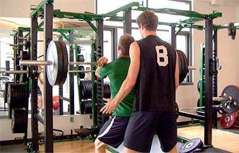

  
  

# Group Members
Natalie Dang
Carlo Viloria
Jerald Cascayan
Darrius Dacquel
Erin Patterson

# Overview
The envisioned app for the UH Recreation Center aims to significantly enhance the fitness journey of students, patrons, and staff by introducing an array of interactive and community-focused features. At its core, the app includes an interactive map that not only details the layout of the facility but also provides specific information on each piece of equipment, including its functionality and instructions for use. A standout feature, the Gym Buddy system, encourages users to create detailed profiles that highlight their fitness objectives, workout schedules, personal achievements, and availability for workouts, fostering a sense of camaraderie and mutual support. Additionally, the app offers a live feed of ongoing and upcoming events, allowing users to see who is participating and perhaps join familiar faces, thus promoting community engagement. Essential for tracking progress, the app also enables users to record and review their past workouts, connections with gym buddies, and event participation, creating a comprehensive fitness log that encourages consistency and motivation.

# Mockup Page Ideas
## Landing Page

The Landing Page serves as the first point of interaction for users. It includes a prominent Call to Action (CTA) that encourages users to sign up or log in. The design matches the theme of gym goers, brief testimonies, app features, etc.

## Dashboard Page

The Dashboard Page is the control center for users after they log in. It provides a quick overview of all features within the app, providing the user a seemingly intuitive and easy to navigate interface.

### Interactive Map Page 

The Interactive Map Page is a highly intuitive and user-friendly feature within the app, designed to provide gym-goers with real-time information about UH MANOA Gym. Users can zoom in and out to explore different areas, and clicking on a gym icon reveals detailed information of the given machine.

### Find a Companion Page

For those looking to use the "Find a Companion" feature, the user will be able to find someone to workout with that includes spotting, general assistance with equipment, guidance with form, etc.

### Progress Tracker Page

Share and view personal information about workout experiences. 

### Events Page
Stay updated on the latest happenings and activities at the gym. Connect with like-minded individuals, and make the most out of your gym experience. Check out the attendees(ie spotter, companion)  to feel more inclined to join.

# Use Case Ideas
## Safety
For individuals working out alone, the Companion Buddy feature acts as a support and real time demand buddy system, ensuring exercises are performed safely.

## Motivation
Users lacking motivation can join community challenges or partner with other users for workouts, fostering a supportive environment and incentives and rewards for partaking in our gym app ecosystem

## Personalized Experience
New gym-goers can use the app to create beginner-friendly workout experiences and data-driven experience to curate a precise and accurate information of their workouts

# Beyond the Basics
For our “special sauce”, we have decided to add a login feature that allows the user to save and view personal information about their workout experiences. The user will be able to save workout routines generated by the app to keep track of what workouts they enjoyed and want to try again. They will also be able to see the buddies/spotters they worked out with in the past so they can easily find them again if they enjoyed their company in the gym. Beyond functions that log past information, we also want to include an experience tracker to make our app more fun and interactive for the user. The user will be able to login and track their personal records and how often they go to the gym. These trackers will contribute to an experience points system that allow the user to gain achievements and levels that can be displayed on their profile. These achievements and levels can become a fun addition to a user’s profile and contribute to the experience of finding a compatible buddy to workout with.
