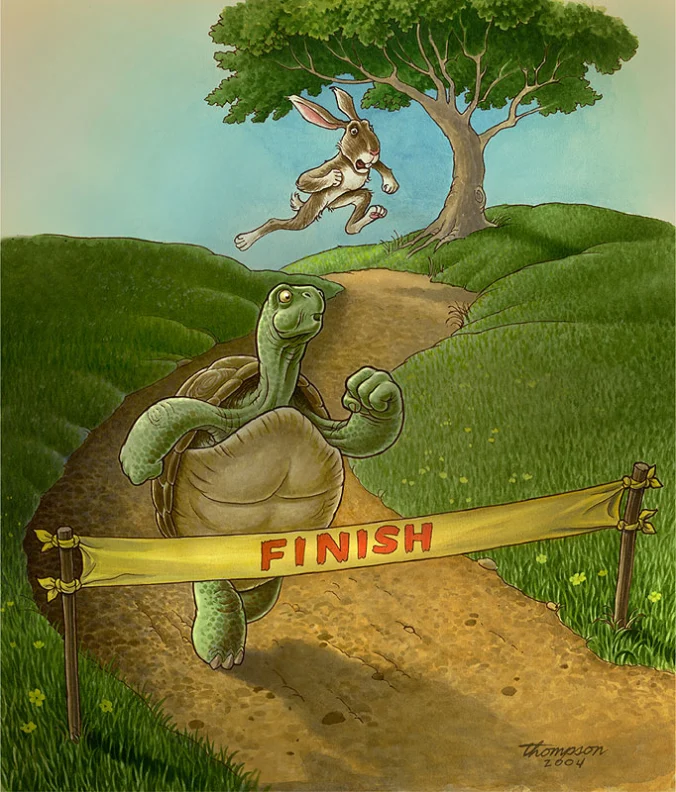

# My Own Pace

Beginning something new is always challenging, especially in the context of computer science. The myriad of languages we eventually become familiar with through our education is not acquired with ease. I personally have struggled through each and every one. 

However, as I continue with my education I have found my own ways to make this struggle a little less of a burden on myself. With my own methods, working at my own pace, I have been able to face new material in software engineering with much less stress and fear than before. 

## On Javascript
My initial impression of Javascript is that is much simpler than Java or any other programming language I have encountered so far. It is straightforward, almost comparable to writing pseudocode in some ways, which makes it incredibly easy to work quickly with. This ease of use and speed can be a god-send in a busy student’s life. 

Despite having no previous experience with Javascript, I found it much more approachable than any other new language. The Free Code Camp lesson was incredibly helpful. Being able to take in information in little pieces at my own pace was really the key to understanding it for me. Moreover, the ability to look back at previous lessons in Free Code Camp even after we are done with the unit is very helpful for any future use of Javascript. To me, the most difficult part of learning Javascript was learning the ES6 rules because they did deal with more complex material than the general Javascript course did. However, after practicing a few times and going back and forth through the unit lessons I was able to gain a grasp on it adequately enough. I believe that I will be able to become more fluent in the language with continued use. 

All in all, I believe Javascript is a good programming language, particularly for shorter, more simple programs like the ones we will be making as students. However, I do think that as code gets more complicated, Javascript might instead start to hinder the coding process instead of aiding it with its simplicity. For example, Javascript does not declare an object type when declaring a function. While in short programs this usually does not lead to any problems and makes things more concise, as a program gets longer and more complex, this could lead to immense confusion. 

## On Athletic Learning
I enjoy the althetic software engineering style of learning. The WODs are extremely useful to me. As I have stated previously, I learn best in small snippets and at my own pace. Having small controlled “practice” codes to test myself with is much more beneficial to my learning than being left to my own devices for large programming projects. While it is stressful, I believe that as long as I have a general idea of what the WOD is like and practice even just a few times beforehand I can make good use of the learning opportunity. One thing I like about it is that it is graded based on completion rather than speed. It fosters the idea that effort and making use of the opportunity to learn is more important than being perfect or fast.

## Conclusion
Java script has been an challenging yet approachable new language that is accessible even without much prior programming experience. Its simplicity makes it perfect for students to use when learning to write their first real programming projects. Additionally, I do believe that my progress in learning Javascript and ES6 has been furthered by athletic learning using the WODs. In conclusion, my experience with computer science has been that slow and steady wins the race and that I should work at my own pace. The small steps in the Javascript unit and the WODs both help to do this. 

