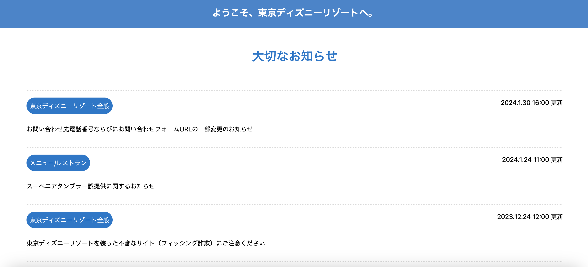

  
  

# Sinking
Until now, the best way I could describe how I felt in my journey learning computer science was that I was floating. Not in a relaxing, calm kind of way. I felt like I was floating, head barely above the water, in a chaotic ocean waiting to pull me down. It dragged me from one place to another, from one concept to another, never allowing me much time to gain my bearings as waves crashed on top of me over and over again. Another new environment, and even more new languages drowning me at each stop. The worst part of it all was that it seemed like in every place the water dragged me, there were already people there and they weren’t drowning. While I was barely keeping afloat, they were charging headfirst towards whatever it was they saw in the distance. I felt like I couldn’t even get my head up enough to look forward. It seemed like everyone knew what they wanted to do or what they enjoyed in computer science. Some people are sure they want to work in backend development or machine learning. Some people can’t seem to stop talking about AI and what it will bring to the future or have a very obvious, burning passion for game development. Other insane people love algorithms and want to solve obscure programming mathematics for the rest of their lives. All of these strong personalities and goals collide in one room in ICS314 and there I was with nothing to claim but a will to pass (yes that was my answer in the survey at the beginning of the semester). I wanted to want more.

# Learning To Swim
Every concept I have gone through in this class and previous classes never really struck anything within me. I continued to float, being dragged back and forth between new career paths, new concepts, and new language, and nothing ever stuck. Nothing really scratched my brain the way I wanted it to. And then we began our module on UI design. At first, it was slow, learning the beginnings of HTML and writing on blank white web pages with ugly black fonts. Then suddenly, it grew into something bigger. Just days after the first white pages we had begun to make full web page designs, albeit not functional yet. But something in me clicked. I remembered using a social media website called Tumblr as a tween and formatting my own blog with HTML. I colored it pink and green and peppered it with sparkles that follow the cursor as you browse through the pictures I posted of all things under the sun that had to do with cuteness. With child-like glee, I realized “Oh my god I could do that for work?”. After that realization, I started having fun with the homework assignments. My favorite was the your choice assignment where I gave myself the challenge of recreating one of my favorite websites, Tokyo Disneyland Resort’s page. The bright colors, organization, and overall appealing design combined with the actual usability of the website made it so fun to attempt to recreate. While the assignment also made me realize I need a lot more practice, it opened my eyes to a potential future career in computer science doing something that I have actually enjoyed doing since I was a child. It made me realize, finally, I was swimming too. 

# Racing
While learning UI Frameworks was nowhere near easy or simple, I feel like with this unit I have finally learned how to pick my head up and start swimming against the waves instead of just letting them pull me about. In fact, with the addition of Bootstrap into our curriculum, I feel like I can go beyond just swimming. I finally understood what everyone else seemed to be charging ahead towards; a future they could imagine themselves in. Until now I couldn’t see it. But now I can. Learning Bootstrap with HTML may seem difficult and unnecessary but now the challenge is inviting. I want to learn how to make webpages more user-friendly while also making them aesthetically pleasing and Bootstrap can be an incredibly significant tool in that. With its array of functionalities, Bootstrap has become a significant asset in my journey toward possibly becoming a front-end developer. It's no longer just about surviving the demands of the digital landscape; it's about thriving and embracing the opportunities that come my way. Now I know it is not just sink or swim. Now I can start the race to the future I envision for myself.
