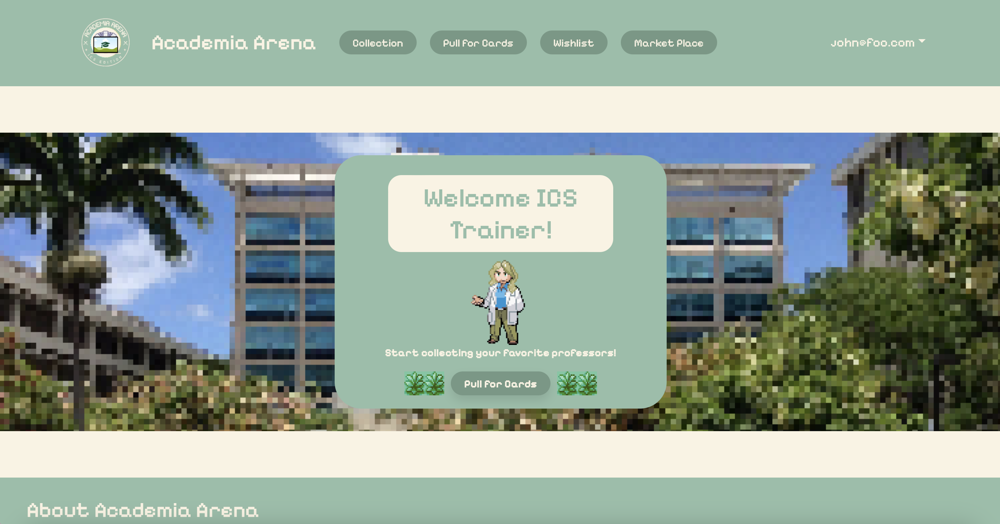
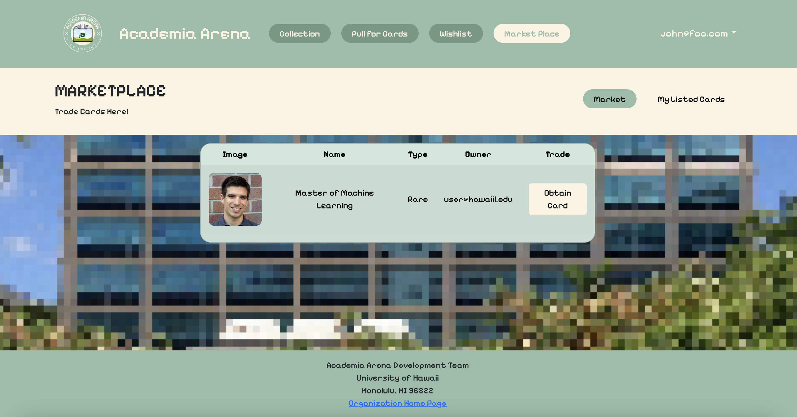
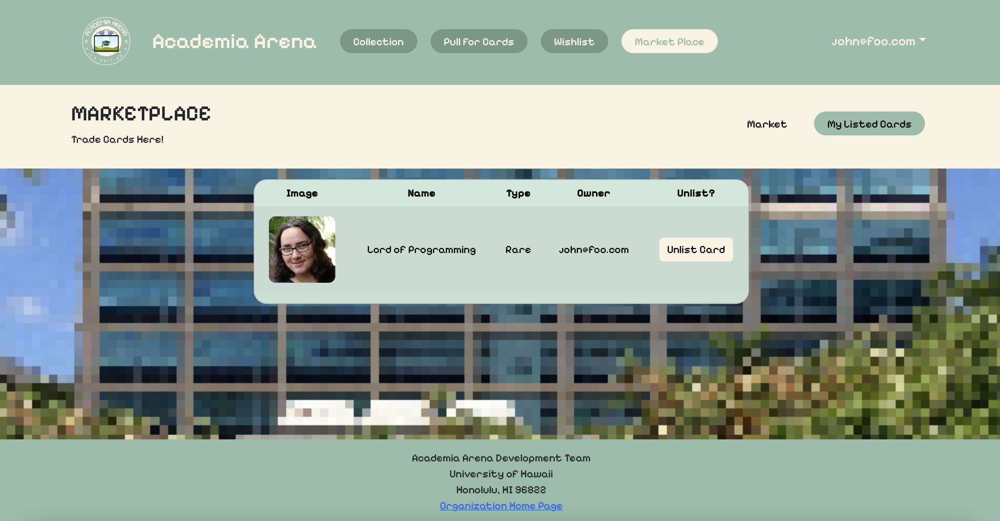
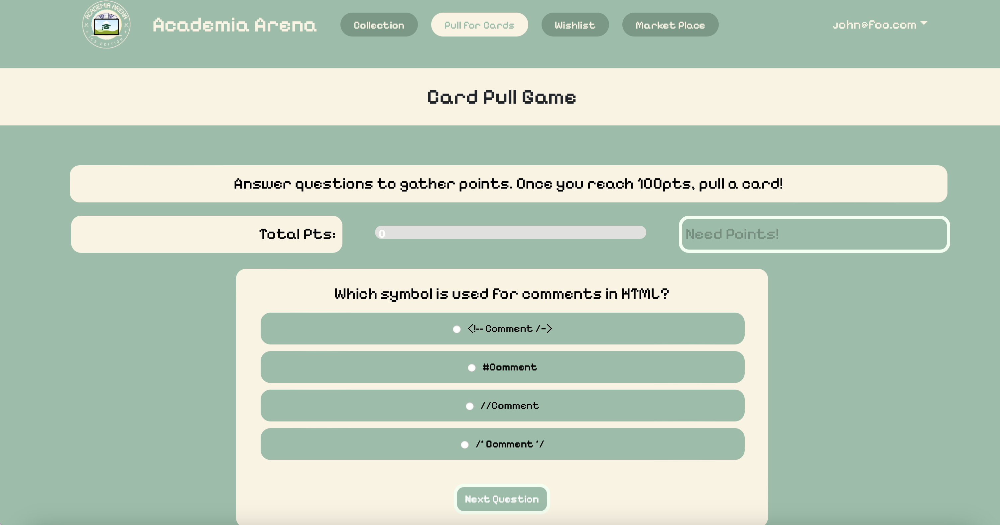

## Overview

        
      

  

      Academia Arena is a web application that a group of students and I created in ICS 314 as our final project. It is a trading card game where the user may pull for, trade, and collect UH Manoa ICS Professors as cards. Academia Arena serves as a cute and fun way for students to get to know the professors they will be learning from during their time as an ICS student at UH Manoa. We hope that it will help to foster a sense of community within the department and encourage students to approach their professors and develop valuable relationships. This application was the culmination of our hard work throughout ICS 314. We were able to put on display our growth in fullstack development including application design, database management, and functional programming. 
  

 

## My Role

### Current Development
My role in the development of Academia Arena focused heavily on front-end development such as user interface and user experience design. I designed the theme for the website and applied it in the css file to the pages the whole group was developing alongside my own. I designed the interface for user navigation in the navbar and in the login, sign up, and sign out pages. However, I was also responsible for a good amount of back-end development as well. The pages I had a major role in developing are shown in the pictures below. 

I was solely responsible for the back-end and front-end development of the Marketplace pages. This is where the user may list their professor cards from their personal collection to trade them with other users as well as obtain cards listed by other users. On the market tab, cards posted by other users are displayed in a table with a button to obtain the card. Upon pressing the button, the application will change the owner of the card from the poster to the current user and take it off the market page. On the listed cards tab, the cards the user has listed are displayed. Here the user can see what they have listed as well as unlist cards. One thing I am proud of in the Marketplace page is my use of active view tabs. I did not want to make two separate pages for the market table and the table that shows the user's personal listed cards so I figured out how to make the tabs switch the active viewing table for the user instead. 

The second page that I was involved in was the card pull page or the quiz page. Though I was not the head developer on the pull page, I did design the page's visuals and quiz concept and I did create a good portion of both the back-end and front-end code. I helped the lead developer complete the quiz function so that upon achieving 100 points the user may draw a card and add it to their collection. To do this, I created a function that populates a an array with our full card set with 10 of each common rank card, 3 of each rare rank card, and 1 of each legendary rank card. This array is populated this way so the user pulls more common cards more often. The function then selects a random card from this weighted array and inserts a copy into the user's collection as well as updates the owner field with the user's email. Additionally, I also created the css styling and functionality for the quiz answer buttons and an error message that appears when a user answers incorrectly.

    
    
    

### Future Goals
Academia Arena is a work in progress and we hope to add many things to its development in the future. I personally would like to improve my trade page by creating a feature that lets users send offers and messages back and forth rather than just listing and obtaining cards. I also think it would be interesting to add a type of in-game currency so users may buy cards from the marketplace as well.

## What I Learned
Academia Arena is the most educational project I have embarked on to date. The amount of experience it has given me and the amount of lessons it has taught me is unparalleled among my other projects. I have learned how to do full-stack development with experience in back-end, database, and front-end development throughout the website. Though there were many moments of frustration, building functions and developing pages that actually worked was extremely satisfying. I am particularly proud of myself for figuring out how to make the active view tabs, the weighted card array, and the pull mechanism for the quiz page. Furthermore, this project really emphasized my growing interest in UI/UX design and application design. It is surprising to me that I would say this about a class project but I genuinely had a lot of fun designing and implementing the visuals of this web app. I hope that my future career path leads me down a direction where I can continue to make use of these skills.

## Links
See our project homepage <a href="https://academia-arena.github.io">here</a>.

See our organization <a href="https://github.com/academia-arena">here</a>.