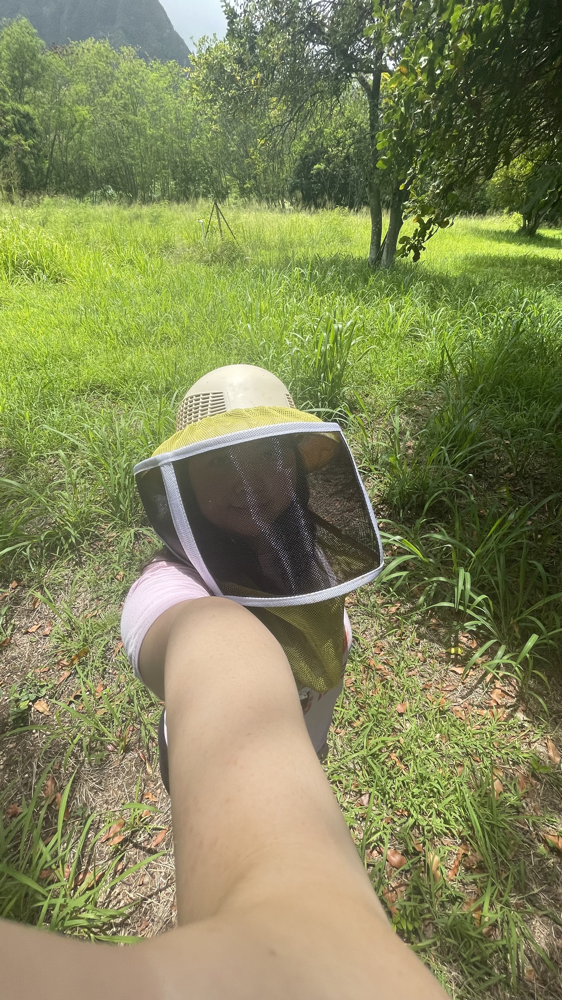
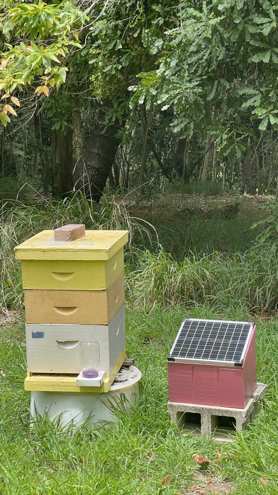
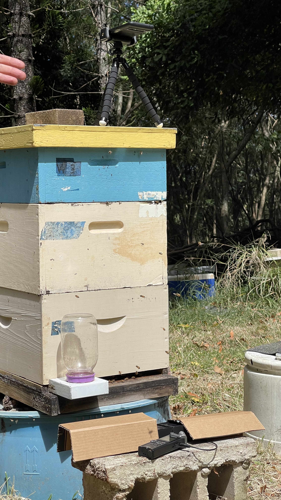

## Overview

  

    
  

  

    The Bee Phone is an ongoing project I am assisting with in Dr. Mark Wright's conservation lab in UH Manoa's College of Tropical Agriculture and Human Resources. This project is still a work in progress with work beginning in 2023. Under the guidance of my lab advisor, I help to maintain and improve a bee hive monitor we have labeled "The Bee Phone". The Bee Phone is a solar powered machine that keeps track of bee populations and habitat conditions within a hive. It tracks how many bees enter and exit the hive while also monitoring the interior temperature. It is dubbed "The Bee Phone" because we programmed it to send data updates to a phone through text when prompted with a text message itself. We can text a bee hive! This project is important to me because it combines computer science technologies like machine learning as well as electrical engineering with conservation biology. The Bee Phone allows us to closely monitor the conditions of the local bee population so we can better manage their health and guard Hawaii's bees against invasive africanized bees.  
  

## My Role

  

    
    
  

  

    In this project, I assist my lab advisor graduate student in maintaining and improving the bee phones as well as analyzing the data we obtain from them. Because the bee phones were built before I began working in the lab, I am mostly responsible for going out into the field and keeping them clean and functioning rather than building them. However, we have begun implementing improvements in the design such as the solar panel tracker you can see in the entrance of the hive in the second picture. This feature is still in development but once completed, it will allow us to track the changes in the hive's population by counting the number of bees entering and exiting the hive. It does so by picking up the shadows cast by the bees as they fly over the solar panels and into or out of the hive. Bees flying in different directions cast different shadows starting from one end to the other of the solar panel. We are currently developing a program that will automate the detection of these shadow differences in the solar panel cells so the machine can track it automatically. 
  

## What Have I Learned
Through the maintenance and improvement of the bee phone I have learned a lot about machine learning and electrical engineering as well as software engineering in relation to conservation biology. I really enjoyed learning through such a hands-on process as I get to directly maintain the bee hives and phones' circuit board inside them. I have also learned a great deal about programming in C++ and Python from my graduate lab advisor. He is involving me in the development of the solar panel feature and showing me how he is coding it to track the direction of bee movement. Though I do not fully understand it yet, I am grateful that he has taken the time to teach me. Another very important thing I have learned from this project is managing and scheduling fieldwork. It is my responsibility to go out into the field and maintain the bee phones often enough to ensure they work properly which has taught me a lot about responsibility and communication with my team. Overall, this project has helped me develop into a better team member and given me a valuable peek into advanced machine learning and programming.  