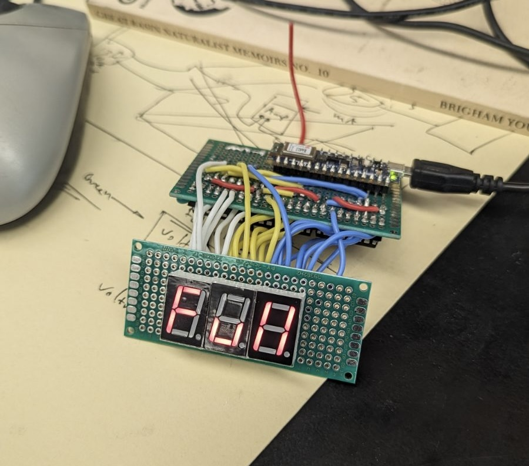
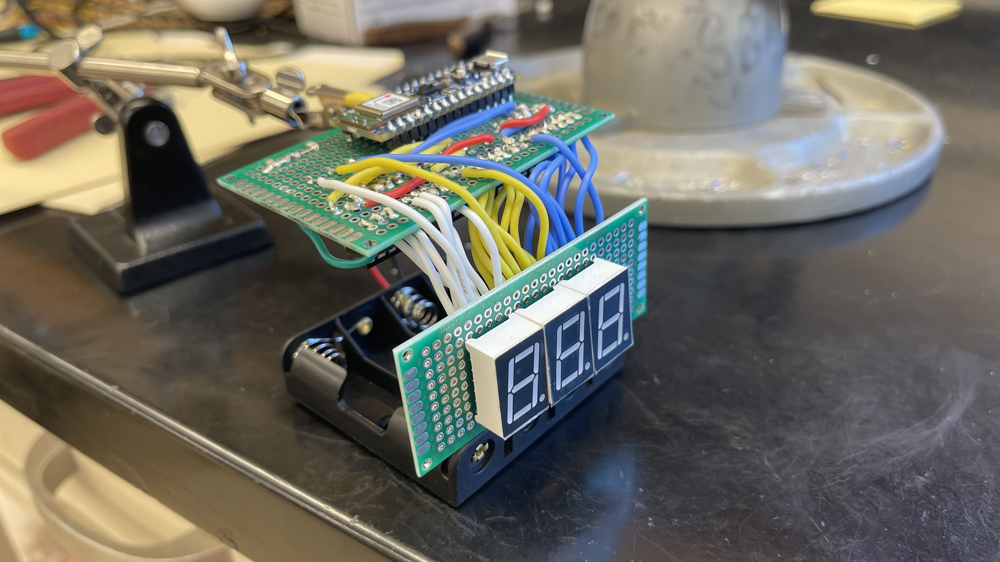
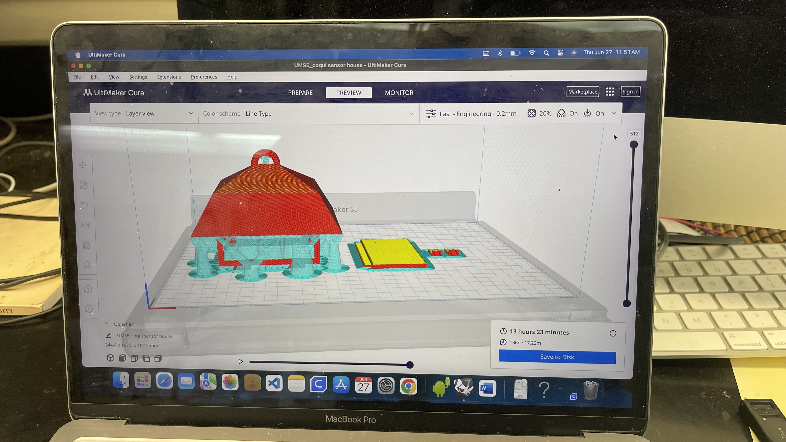
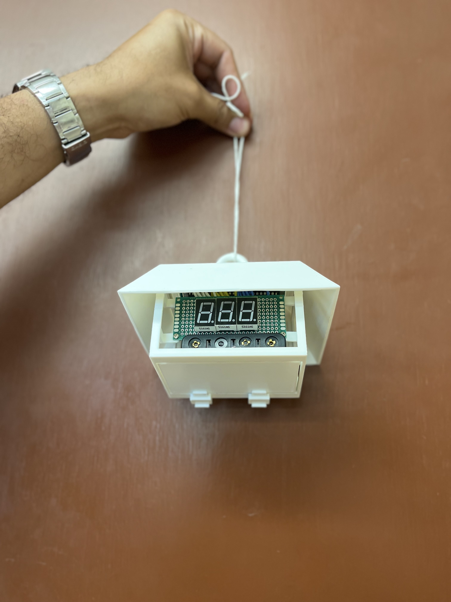

## Overview

  

    
  

  

    The Coqui Frog Sensor is a project I assisted with in Dr. Mark Wright's lab in UH Manoa's College of Tropical Agriculture and Human Resources (CTAHR) working with my graduate student mentor Ali Miarkiani. We constructed a sensor machine that will pick up the Coqui Frogs' call and alerts us to their presence in the vicinity of the sensor. It will count the number of coqui frog calls in the area it is placed in. It is used to track the invasive population's presence and predicted density in various forests on the Hawaiian islands as they can have a heavy impact on the insect life of Hawai'i as well as on native insect-plant relations. I believe that combining machine learning, software engineering, and biology like this is the future of conservation efforts.
  

 

## My Role

  

    
  

  

    In this project I assisted in designing, programming, and building the Coqui frog sensor from start to finish and I am also in charge of mass producing multiple sensors so we can place them in different locations and get a wide range of data. The first part of the process of building the sensor was to collect data on coqui frog calls to train the sensor to recognize them and count them. I listened to over 5 hours of coqui frog recordings to take over 300 samples of isolated coqui frog calls and used the samples with machine learning to program our sensor to count their calls. Additionally, I also took about 1000 samples of unrelated sounds to train the sensor to ignore any non-coqui sounds. The picture to the left is of me and my trusty lab assistant, April, taking coqui frog samples on the audio editing software Audacity.
 
While in the process of building my sample library, I also began to wire the sensor's electrical circuitry on a breadboard as shown in the second picture below. The breadboard allows me to plan out my wiring before I solder the actual machine and the chosen arduino sensor onto a perfboard for more practical use. During this step I added a number display that will show the number of coqui calls picked up by the sensor. The 3 digit display can show up to 999 calls picked up. I address this limit further in my programming of the sensor itself.

The next part of this process involved machine learning. I used the collected audio samples to train a sensor to pick up only coqui frog calls and ignore all other sounds. I did so through Edge Impulse, a program that allows me to upload my samples and train my chosen sensor, the Arduino Nano 33 BLE. Next, I programmed the sensor using C++ to count the coqui frog sounds it picks up. I also programmed the 3 digit display to count up to 999 and then display the word "full" once it reaches 1000 as shown in the second picture below. When the display is full, we will collect and reset the sensors. You can see my full code <a href="https://github.com/erinlpat/erinlpat.github.io/blob/main/code/coquiFrogSensor.cpp">here</a>.
  

 

    
    

 

After training my Arduino sensor, I disconnected it from my breadboard and began to solder it to a perfboard to make it permanent. You can see one of our sensors in its early stages that I soldered to a perfboard in the pictures below. The second picture shows my other trusty lab assistant, Lexie, checking my soldering quality.

    
    
    

After building the sensor itself, I then designed housing for it that would protect it from the elements when placed in the field to track the coqui frogs. To do so, I used the 3D modeling program Rhinoceros 3D. The goal was to create a design that wouldn’t appear harsh or out of place in the natural habitats where coqui frogs thrive, but would still be easily identifiable when the sensors needed to be collected. We decided to model the housing on bird houses. This style not only shields the sensor from harsh, wet conditions because of the roof-like top but also ensures that it can be positioned in areas where it will collect the most data, as coqui frogs are often found in damp, rainforest-like ecosystems. We are able to place the sensors high in trees or on the ground. 

    
    

## What Have I Learned so Far?
By working on the Coqui Frog Sensor project, I have gained invaluable experience in machine learning, software engineering, electrical engineering, 3D modeling, and conservation. This project has been the most significant in my educational journey, offering hands-on learning that accelerated my growth in these fields. Prior to this project, I had no experience with Edge Impulse, circuitry, or electrical engineering, but through collaboration with my mentors and my lab, I learned how to build, solder, and program Arduino-based sensors from scratch. I also taught myself 3D modeling using Rhinoceros 3D with the help of my mentor.

This project has also strengthened my programming skills, particularly in training sensors using machine learning algorithms and integrating software with hardware components. Through trial and error, I gained a deeper understanding of how to optimize sensor performance and data collection for ecological monitoring. The challenges of learning these technical skills from scratch were made easier by the collaborative environment I worked in. Regular feedback from my mentors helped me refine both the sensor's functionality and my approach to problem-solving. I learned how to take constructive criticism and use it to make meaningful improvements, which not only enhanced the project but also my own technical capabilities.

The project also taught me a great deal about team and project management. Setting clear goals, having open communication with my lab director and mentor, and regularly revising my work based on feedback were all essential to our progress in this project. It was my first time working closely with a team of mentors to create something tangible, and it was very rewarding. This experience sharpened my ability to take initiative and adapt to changing situations and goals. My career goal is to work in a field that combines biology and conservation with technology, much like this project so it was an invaluable experience to have as I work towards my own future.
