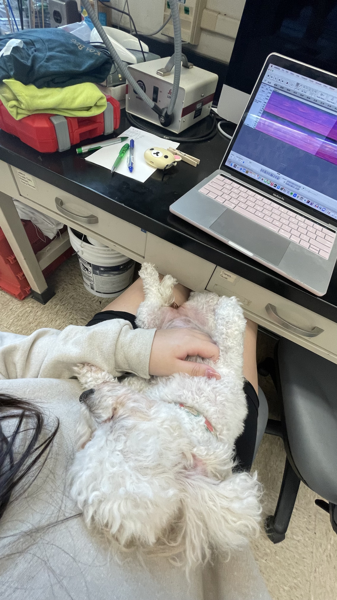
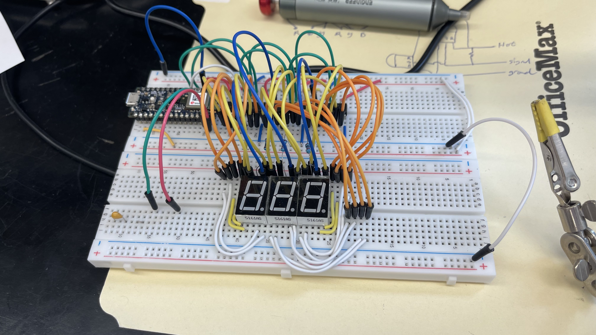
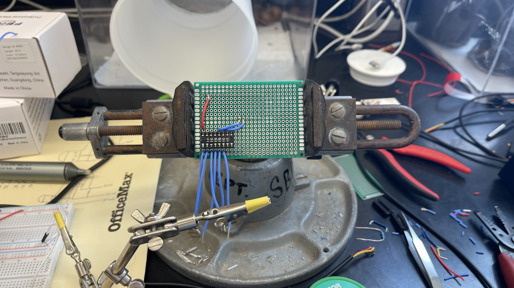
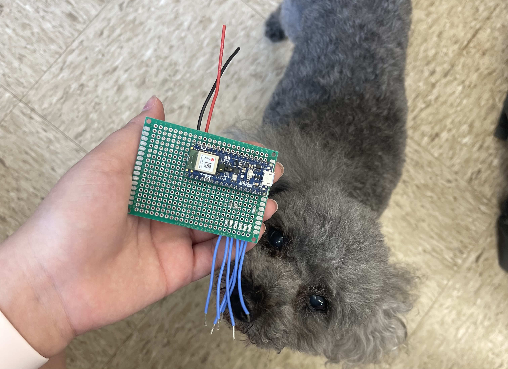

## Overview

  

    
  

  

    The Coqui Frog Sensor is an ongoing project I am assisting with in Dr. Mark Wright's conservation lab in UH Manoa's College of Tropical Agriculture and Human Resources. This project is still a work in progress with work beginning in November of 2023. We are constructing a machine that will sense the Coqui Frogs' call and alerts us to their presence in the vicinity of the sensor. It will count the number of coqui frog calls in the area it is placed in. It is used to track the invasive population's presence and predicted density in various forests on the Hawaiian islands as they can have a heavy impact on the insect life of Hawai'i as well as on native insect-plant relations. I believe that combining machine learning, software engineering, and biology like this is the future of conservation efforts.
  

 

## My Role

  

    
  

  

    In this project I am assisting in building the Coqui frog sensor from start to finish and after we develop the final product, I will be in charge of producing multiple sensors so we can place them in different locations and get a wide range of data. The first part of the process of building the sensor was to collect data on coqui frog calls to train the sensor to pick them up. I listened to over 5 hours of coqui frog recordings at took over 200 samples of isolated coqui frog calls to train our machine. Moreover, I also took about 1000 samples of unrelated sounds to train the sensor to ignore any non-coqui sounds. The first picture above is of me and my trusty lab assistant April taking coqui frog samples on the audio editing software Audacity.

While in the process of building my sample library, I also began to wire the sensor's electrical circuitry on a breadboard as shown in the second picture above. The breadboard allows me to plan out my wiring before I solder the actual machine and the sensor onto a perfboard for more permanent use. During this step I added a number display that will show the number of coqui calls picked up by the sensor. The 3 digit display can show up to 999 calls picked up. I address this limit further in my programming of the sensor itself.

The next part of this process involved machine learning. I used the collected audio samples to train a sensor to pick up only coqui frog calls and ignore all other sounds. I did so through Edge Impulse, a program that allows me to upload my samples and train my chosen sensor, the Arduino Nano 33 BLE. Next, I programmed the sensor using C++ to count the coqui frog sounds it picks up. I also programmed the 3 digit display to count up to 999 and then display the word "full" once it reaches 1000. When the display is full, we will collect and reset the sensors. You can see my full code [here](https://www.google.com).
  

    
    
    

After training my Arduino sensor, I connected it to my breadboard and began to solder it to a perfboard to make it permanent. I am currently in this stage of the sensor's creation. You can see my progress on the perfboard in the last two pictures above. The last picture shows my other trusty lab assitant lexie checking my soldering quality.

Once this sensor is finished and we deploy it into the field we will record how well it works and its data to present to our lab director and other conservation workers at the university. Each sensor costs about $40 to $50 dollars to make and hopefully with approval I will begin to produce more sensors so we can place them in many places around the islands. Other than development, I am also responsible for fieldwork for the sensors so I will be placing them and maintaining them as they keep track of the coqui frogs. 

## What Have I Learned so Far?
By learning about and building a Coqui Frog Sensor, I have gained experience in machine learning, software engineering, and electrical engineering. This project is still ongoing but it is the most relevant project I have worked on in my educational journey. Working in the lab, along with the fieldwork, is a great experience and the hands-on style has helped me progress my skills in programming, machine learning, and electrical engineering at great speeds. Before this project I had never even touched edge impulse or circuitry of any kind. Now, I can build and solder electric devices and train arduino sensors on my own. Moreover, this project has taught me a great deal about project and team management. This was my first experience really working to create something with a team of mentors and I am extremely grateful for it. My career goal is to work in a field that combines biology and conservation with technology just as this project does so working on the sensor has been an amazing experience. I hope our project is approved and we will be able to deploy many sensors around the islands. 
