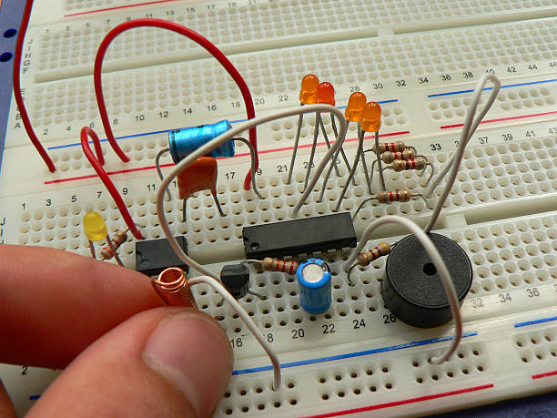

  
  

## Overview
The Coqui Frog Sensor is an ongoing project I am assisting with in the UH Manoa Entomology lab. This project is still in its very beginning stages with work beginning in November of 2023. The current hope is that the machine will sense the Coqui Frogs' call and alerts us to their presence in the vicinity of the sensor. It is used to track the invasive population as they can have a hevay impact on the insect life of Hawai'i as well as on native insect-plant relations. Combining machine learning, computer sciences, and biology is going to be the future of conservation efforts. The machine aspect will help us automate a portion of our conservation efforts to make the overall goal of protecting native insect life easier and more efficient. 

## My Role
In this project I am assisting in building the Coqui frog sensor on a bread board and I will later transfer and soder the finished circuits to a proper circuit board. I also assist with the machine learning and programming of the sensor in python under the guidance of a graduate student in the College of Tropical Agriculture and Human Resources. I assist them with fieldwork and lab work.

## What Have I Learned so Far?
By learning about and building a Coqui Frog Sensor, I have gained experience in machine learning, working with python, and circuitry. This project is still in its very early stages and currently ongoing but it is the most relevant project I have worked on up to date. Working in the lab, along with the fieldwork, is a great experience and the hands-on style has helped me progress my skills in programming and machine learning at an unprecendented speed. My career goal is to work in a field that combines biology and conservation with technology just as this project does so working on the sensor has been an amazing experience. Once I have more material on this project I will continue to update my portfolio.
