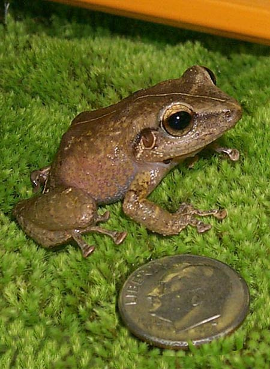

  
  

## Overview
The Coqui Frog Sensor is an ongoing project I am assisting with in Dr. Mark Wright's conservation lab in UH Manoa's College of Tropical Agriculture and Human Resources. This project is still a work in progress with work beginning in November of 2023. We are constructing a machine that will sense the Coqui Frogs' call and alerts us to their presence in the vicinity of the sensor. It will count the number of coqui frog calls in the area it is placed in. It is used to track the invasive population's presence and predicted density in various forests on the Hawaiian islands as they can have a heavy impact on the insect life of Hawai'i as well as on native insect-plant relations. I believe that combining machine learning, software engineering, and biology like this is the future of conservation efforts. 

## My Role

  

    
  

  

    In this project I am assisting in building the Coqui frog sensor from start to finish and after we develop the final product, I will be in charge of producing multiple sensors so we can place them in different locations and get a wide range of data. The first part of the process of building the sensor was to collect data on coqui frog calls to train the sensor to pick them up. I listened to over 5 hours of coqui frog recordings at took over 200 samples of isolated coqui frog calls to train our machine. To the left is a picture of me and my trusty lab assistant April taking coqui frog samples on the audio editing software Audacity.
  

## What Have I Learned so Far?
By learning about and building a Coqui Frog Sensor, I have gained experience in machine learning, working with python, and circuitry. This project is still in its very early stages and currently ongoing but it is the most relevant project I have worked on up to date. Working in the lab, along with the fieldwork, is a great experience and the hands-on style has helped me progress my skills in programming and machine learning at an unprecendented speed. My career goal is to work in a field that combines biology and conservation with technology just as this project does so working on the sensor has been an amazing experience. Once I have more material on this project I will continue to update my portfolio.
