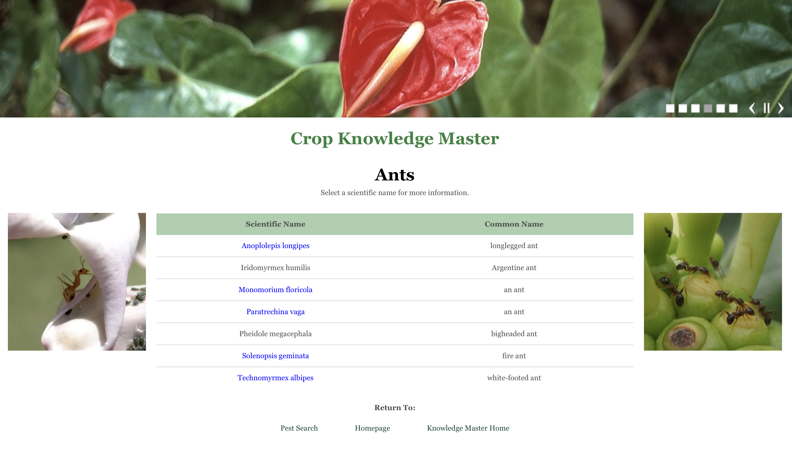

## Overview

        
      

  

The Crop Knowledge Master website is an educational resource that is centered on pests and diseases affecting crops and is an essential resource for individuals working in agriculture or entymology, conservation, and education. It acts as a comprehensive database that provides information on identifying, understanding, and managing the threats that various pests and diseases pose to crop health. It includes a wide variety crops as well as ones indigenous to the Hawaiian islands. This website consolidates extensive data on numerous plant species, their associated pests, disease symptoms, and effective treatment or prevention methods, all in one easy-to-access location. The website is intended to address the growing need for centralized, accurate information that can aid in safeguarding crops from damage as well as offer solutions for pest control that avoid the use of harmful practices like pesticides by educating users on insect control through physical or biological means. By offering up-to-date, reliable data, it also supports educational efforts and research into sustainable agriculture practices. Through this platform, users can make informed decisions to protect their crops while also promoting more environmentally friendly pest control measures that align with conservation goals.
  

 

## My Role
This is a project I am helping with as a part of Dr. Mark Wright's lab in the College of Tropical Agriculture and Human Resources (CTAHR). In my role as both the designer and developer of the website, my primary objective is to create a platform that not only looks visually appealing but also functions in a way that allows ease of use for a wide audience. I am designing the user interface with simplicity and efficiency in mind, ensuring that even those with minimal technological experience could navigate the website without difficulty. Because this project mostly involves migrating an old website over to a newer one, I am making special effort to create a more seamless user experience, where users can easily find and access the information they need with minimal effort while also maintaining the accuracy and depth of the information from the previous website. This meant designing simple navigation, clear labeling, and a responsive layout that can adapt to different screen sizes and devices. I think it is important that this website is easy to view on mobile devices so users can make use of it in the field where they will need the information the most. Along with the written information and web design, I am also in charge of updating the pictures on the website to include visual aids that can show users an accurate representation of what a pest or disease might look like on their crops. 

### Current Development and Future Goals
Currently, development is in its earlier stages as the bulk of the old website has not been migrated to the new one yet. I am focusing mostly on designing an interface that can satisfy the needs of the users visiting our website and confirming that my designs are in compliance with how our lab needs the website to look. Once all interface designs and functional decisions are made I will begin to migrate all of the information over and fill the website with the text and pictures needed.

    
    

## What I Learned
Throughout the process of building and designing this website, I gained a lot of experience, both in technical aspects and subject matter expertise. On the technical side, I refined my web design skills, particularly in implementing UI/UX principles that prioritize user needs and enhance the overall experience. I learned how to structure content to make it visually appealing while maintaining functionality, ensuring that the most important information is immediately accessible while more detailed content remains available for those seeking it. From a subject matter perspective, I expanded my knowledge of plant pests and diseases, learning about the various species and their impacts on different crops. Finally, I also improved my project management skills, learning how to meet development goals in a timely manner and improved at using feedback to make meaningful improvements to the website's visuals, usability, and accuracy. This process helped me develop a more collaborative approach, ensuring the website met high standards for educational and agricultural use.

## Links
Links will be added in the future as development proceeds and the Crop Knowledge Master website is published.

