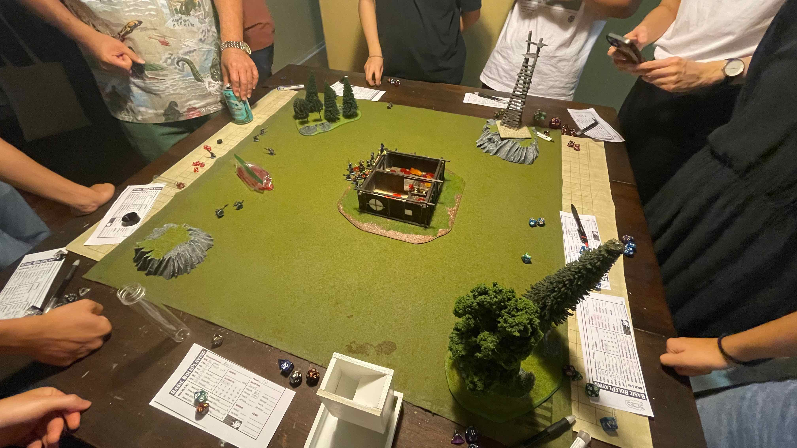
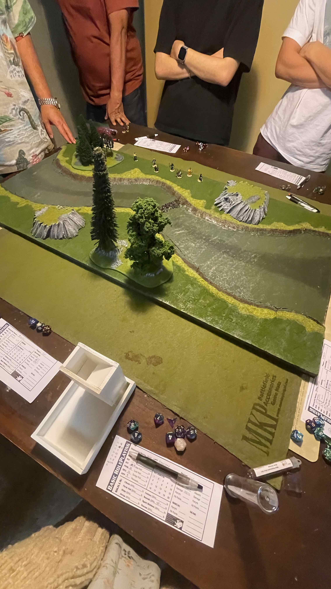
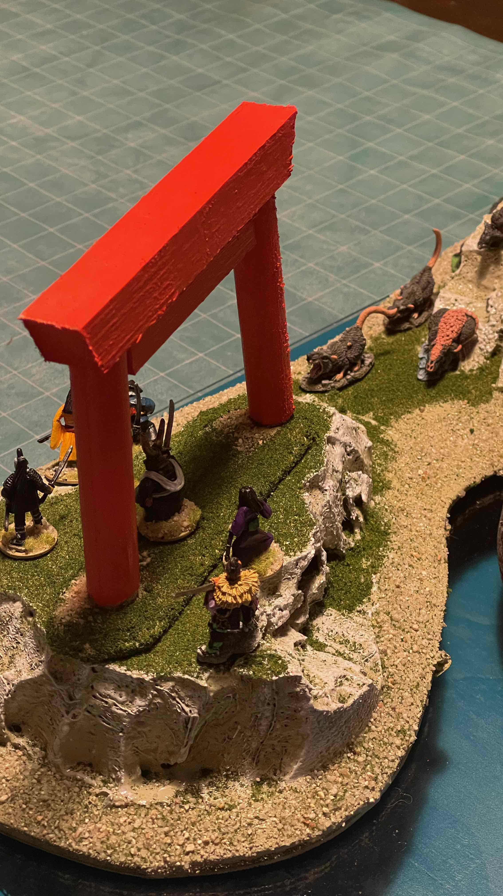

  
  
  

This project is a year-long Dungeons and Dragons campaign that ran from the spring of 2022 until the spring of 2023. I worked together with the Game Master to build the game, the terrain, and created a program for the game as well.

This DnD campaign was one of the first ones I had a hand in creating instead of just participating in. I had just began to learn how to code in Javascript and decided to create a random dice roll program to use for our game just for fun, especially for when our party met remotely instead of physically at the table. In addition to the dice roll program I also created physical terrain builds to aid in immersion and table-top quality during gaming sessions. 

This project helped me gain experience using Javascript and was part of how I discover how coding can be applicable to real-life scenarios even in small ways. Other than technical skills, this campaign put me in a position of leadership where I had to consistently organize and maintain gaming sessions, story-building, and manage a team of 8 players. This helped me learn how to lead complex projects and foster teamwork and creativity in a group of people new to the game. 

Below I will include my dice roll program.

