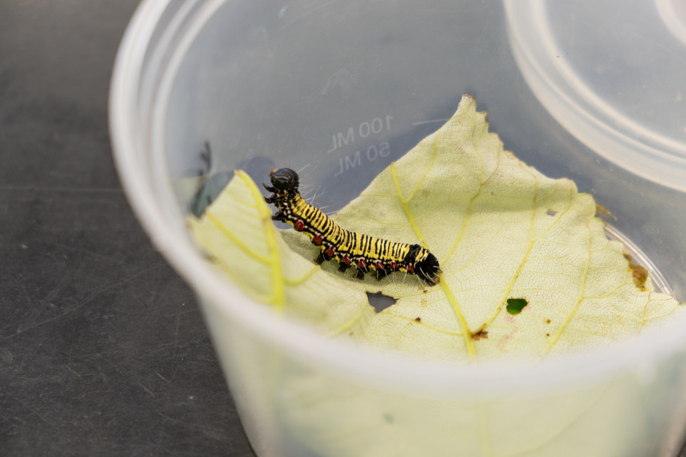

## Overview

  

    
  

  

    The Episimis Life Table project is a project I assist with in Dr. Mark Wright's lab in UH Manoa's College of Tropical Agriculture and Human Resources (CTAHR) working under Michelle Au.
  

 

## My Role

  

    
  

  

    Hello
  

## What Have I Learned so Far?
Hello
