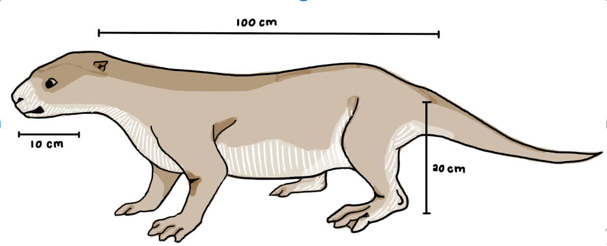
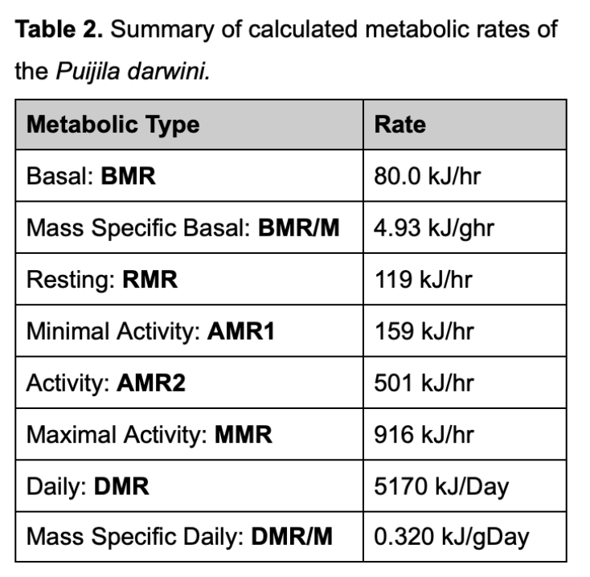
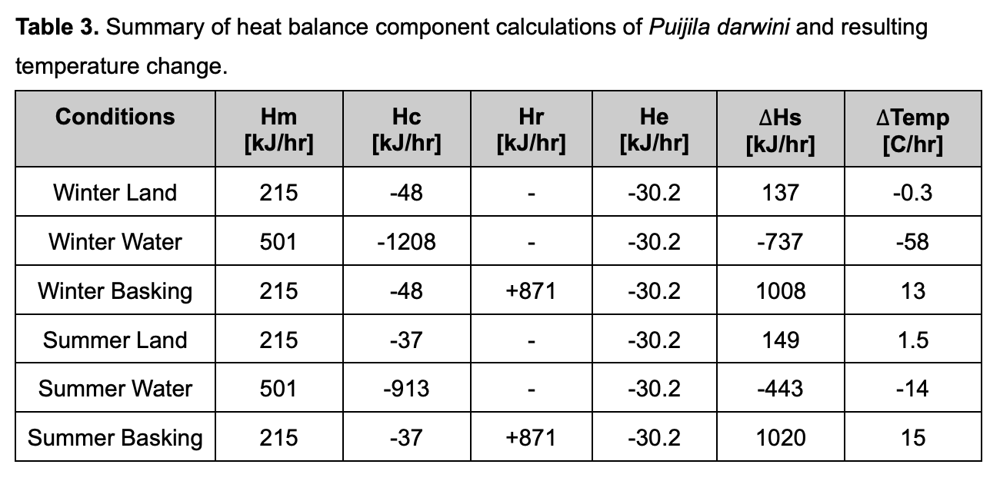

  
  
  

## Overview
This was a research project I worked on for the entirety of the semester in ZOOL430 (Animal Physiology). I used R and excel to calculate the possible metabolic rates and heat balances of the extinct Puijila darwini based on its fossil morphology alone. Projects like this allow us to better understand the biology and evolution of species not present in modern-day biodiversity. By extension they also allow us to see how extant species function in relation to their ancestors' biology. 

## My Role
As this was a completely independent project, I took charge of all facets of research, analysis, and presentation. I studied the fossils of the Puijila darwini and took measurements of the body's morphology and then analyzed the measurements to make predictions about how the Puijila darwini used its body in its everyday life. Using this data as well as data from modern day pinnipeds I was able to extrapolate the various basal and active metabolic rates of the Puijila darwini using R and excel for my calculations. Additionally, I took the extra steps to calculate how temperature differences would affect their metabolic rate as the Puijila darwini often lived in cold environments. In this way I calculated the metabolic rates at rest and at activity in different temperatures such as under heat stress and cold stress for the extinct organism.

## What I Learned
In this project I gained experience with data science and its associated technologies like the program R. I also learned valuable lessons about research methods and how to ensure your data is reliable and significant. I used R to compile, analyze, and extrapolate data about the Puijila darwini's metabolic rates using just measurements from the physical morphology of its fossil and modern data from extant pinnipeds. Doing my own research about the species and then having to translate that data into programming skills was an extremely challenging yet interesting endeavour. I also learned a lot about compiling and presenting data in a readable and understandable way during this project so that I could properly present my findings to an uninvolved audience.

Here is a link to the full <a href="https://erinlpat.github.io/essays/PuijilaMetabolism.pdf" target="_blank">paper.</a>

Below is an excerpt of code I created in R to do these calculations.

