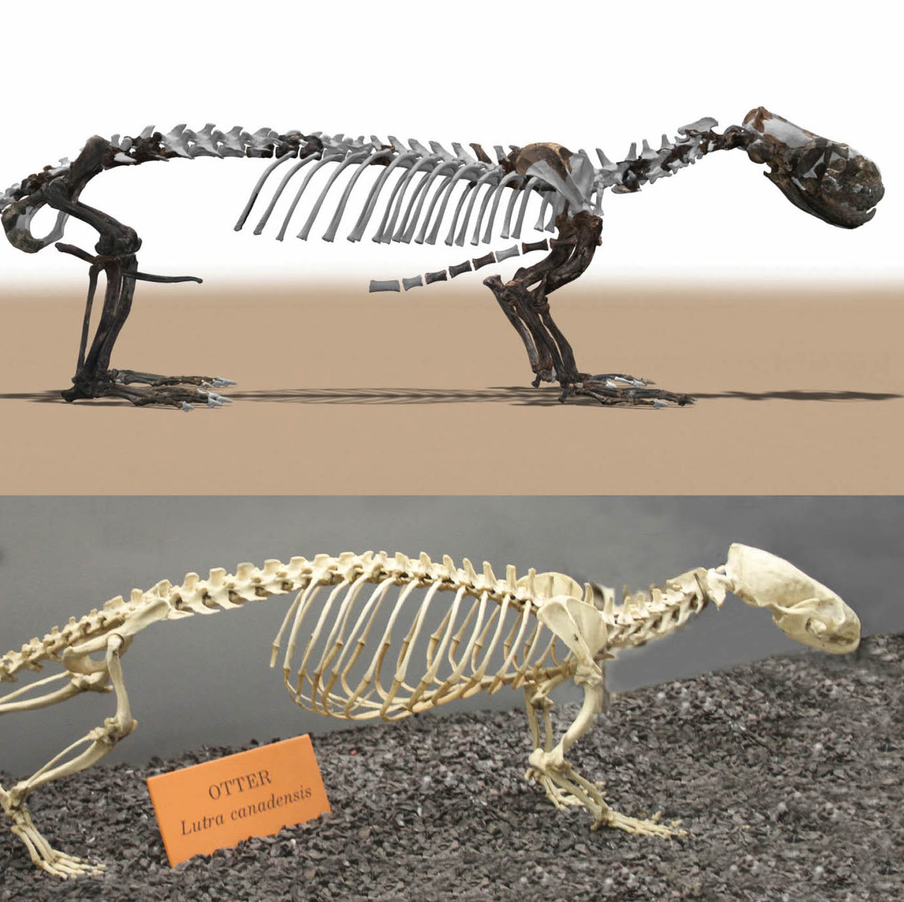

  
  
  

This was a research project I worked on for the entirety of the semester in ZOOL430 (Animal Physiology). 

I used R and excel to calculate the possible metabolic rates and heat balances of the extinct Puijila darwini based on its fossil morphology alone. Projects like this allow us to better understand the biology and evolution of species not present in modern-day biodiversity. By extension they also allow us to better understand how extant species function in relation to their ancestors' biology. 

In this project I gained experience with data science and its associated technologies including R. I used R to compile, analyze, and extrapolate data about the Puijila darwini's metabolic rates using just measurements from the physical morphology of its fossil.

Below is an exerpt of code I created in R to do these calculations.

