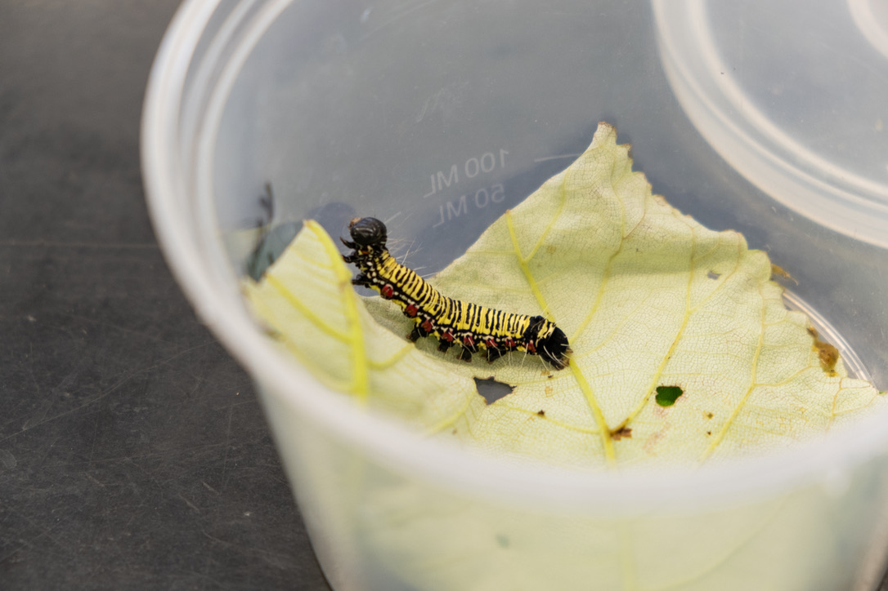
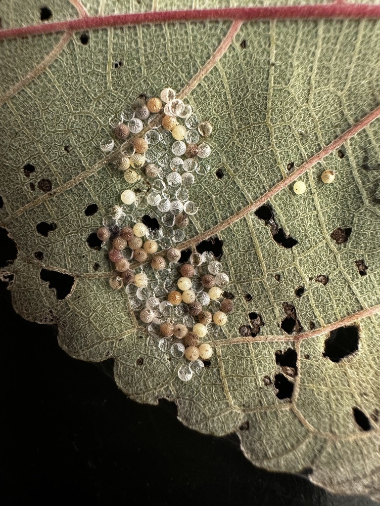
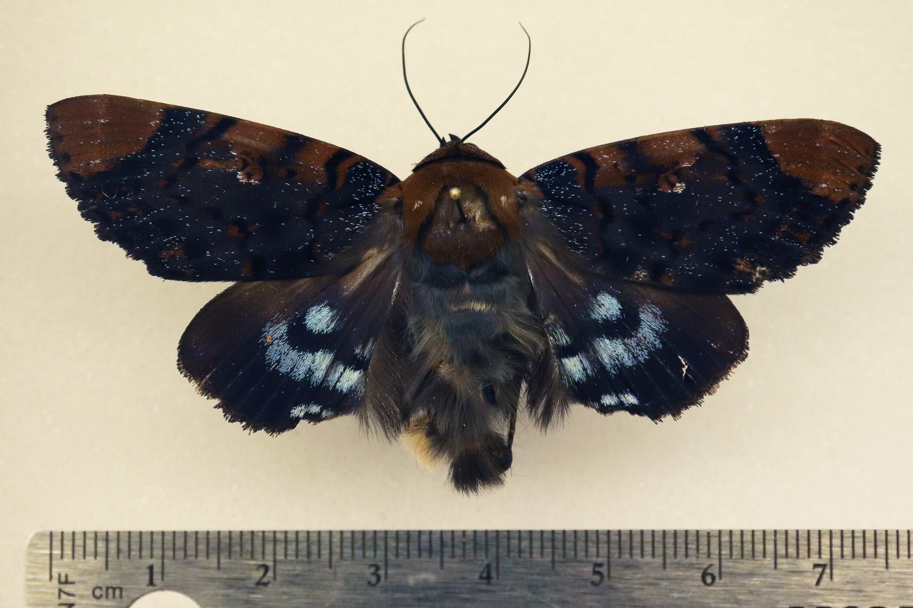

## Overview

  

    
  

  

    The Ramie Moth Colony is a project I assist with in Dr. Mark Wright's lab in UH Manoa's College of Tropical Agriculture and Human Resources (CTAHR) working under Michelle Au. The Ramie moth (<i>Arcte coerula</i>) is a newly detected invasive species in Hawaii, first appearing on Oahu in October 2024. This species poses a significant threat to Hawaii’s native ecosystems because its larvae feed on māmaki (<i>Pipturus albidus</i>), a native Hawaiian plant that serves as an essential food source for endemic insects like the Kamehameha butterfly (<i>Vanessa tameamea</i>). If left unchecked, the Ramie moth could contribute to the decline of māmaki and Kamehameha butterfly populations, disrupting the delicate balance of Hawaii’s ecosystems. Understanding the moth’s biology, reproductive patterns, and population dynamics is critical to developing a sustainable control strategy. While field studies provide insights into their natural behavior, maintaining a lab colony allows for controlled experiments and continuous observation. My research focuses on establishing a dependable Ramie moth colony to collect foundational data on its life cycle, reproductive success, and behavioral traits. This information will be essential in designing an effective biocontrol strategy to regulate the species’ population without relying on harmful chemical pesticides or disruptive pest control methods that can often do more harm than good.
  

 

## My Role

  

    
  

  

    As part of this project, I am responsible for raising and maintaining the Ramie moth colony in the lab. My work involves caring for the colony by rearing caterpillars through their five instars, monitoring pupation rates, and tracking adult emergence. I also collect and analyze life history data, including mortality rates at each developmental stage, pupation success, and reproductive output such as egg production and mating success. Additionally, I observe behavioral differences in reproduction and development under different environmental conditions. An interesting part of our current observations involve tracking egg-laying and hatching rates to understand reproductive success. We also analyze female-to-male ratios from different collection locations across the island, allowing us to investigate how environmental factors influence population dynamics. For example, we found that sites with high parasitization rates had higher egg-laying rates per female, leading us to hypothesize that females may increase reproductive output in response to environmental stressors. Additionally, these locations had more females than males, suggesting that certain environmental pressures might be influencing sex ratios.
  

 

## What Have I Learned so Far?

  

    
  

  

    This research has provided me with the opportunity to expand my laboratory skills and data analysis abilities. Through my daily tasks, I have gained hands-on experience in rearing and maintaining live insect colonies, which requires careful attention to environmental conditions, diet, and developmental stages to ensure a healthy population. I have also strengthened my ability to work with live specimens and developed my precision in biological research. An interesting example of a new skill I learned through this project is determining the sex of unemerged moths by their pupa cases. By using microscopes I can sex pupae by identifying external male or female genital structures and as a result I have improved my proficiency with laboratory equipment and attention to detail. Additionally, tracking egg-laying rates, hatching success, and sex ratios has helped me understand how reproductive biology can be influenced by environmental factors, leading me to consider broader ecological implications.  
  

Beyond hands-on lab work, this project has also strengthened my computational and data analysis skills. By compiling life history data such as instar survival rates, pupation success, and adult emergence, I have applied Python, R, and Excel to process large datasets and analyze trends in population dynamics. Working with real-time biological data has deepened my understanding of statistical analysis in ecology, allowing me to draw connections between field observations and controlled laboratory experiments. Learning how to design and analyze life tables has given me a structured approach to tracking invasive species populations, which is valuable for both research and conservation applications. Furthermore, interpreting sex ratios and reproductive patterns from different collection sites has taught me how environmental factors such as predation, parasitization, and habitat conditions can shape population structures. Because this project is still ongoing and in its earlier stages, I will embed snippets of code here later, further along in development.

 

## Future Plans
Moving forward, our research will focus on optimizing lab conditions to improve mating success and egg viability. As of now, we have yet to successfully have the Ramie moths breed and reproduce in the lab. We also aim to compare lab and field populations to identify any behavioral or physiological differences that may influence their survival and spread. Additionally, we plan to continue investigating how environmental factors affect sex ratios and reproductive strategies across different locations on Oahu. We will also explore how the species arrived in Oahu suddenly after being present in Hawaii for many years already. Ultimately, the goal of this study is to develop a biological control solution—a targeted, ecologically safe method to regulate the Ramie moth population without resorting to pesticides or other control measures that could harm Hawaii’s fragile native ecosystems. By refining our understanding of this invasive species, we hope to contribute to sustainable conservation efforts that protect Hawaii’s native flora and fauna.
